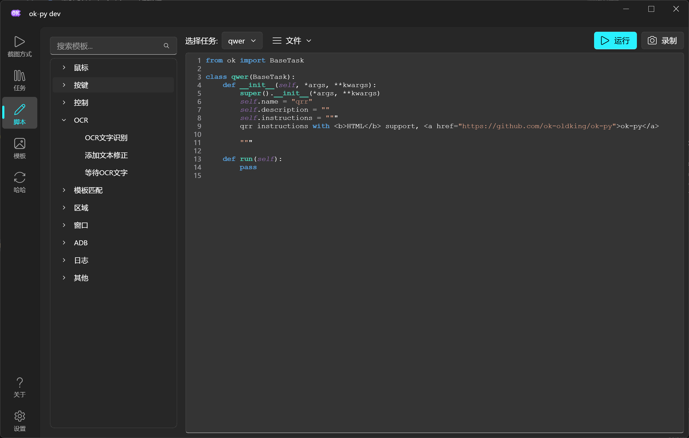
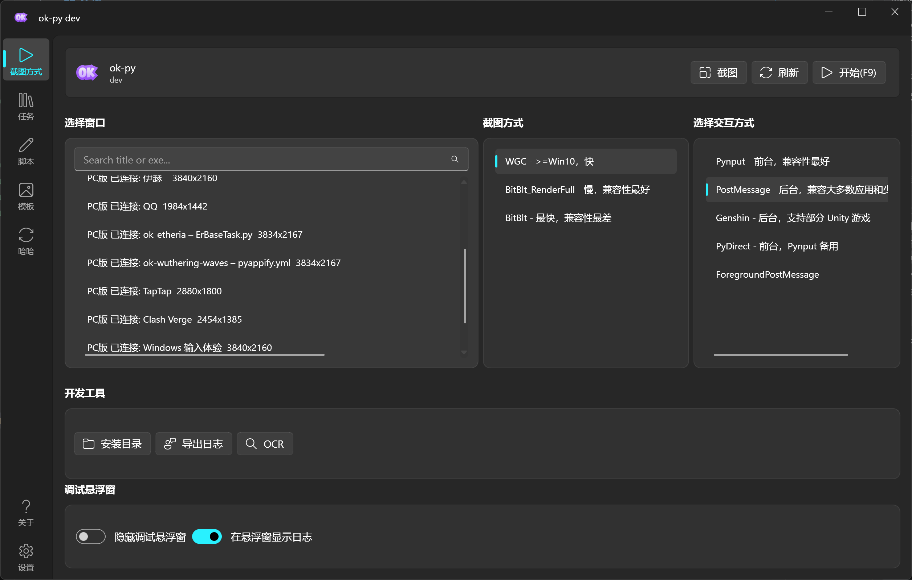
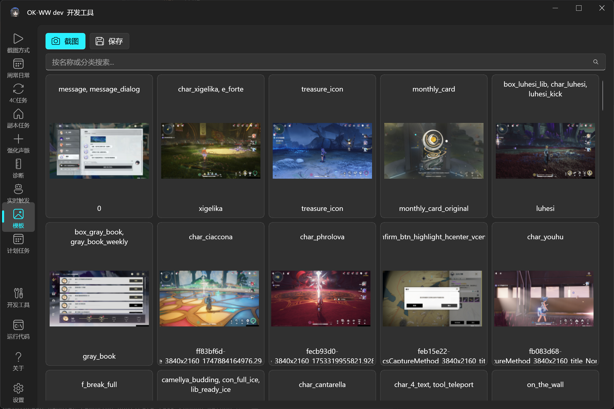
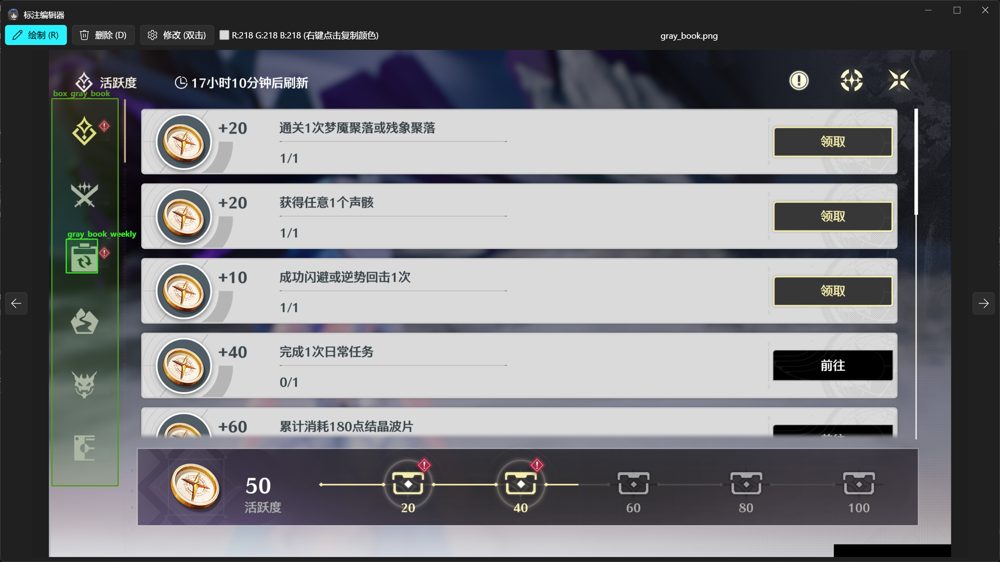

# ok-script-app

English | [中文](README.md)

ok-script-app is a Python automation project template built on [ok-script](https://github.com/ok-oldking/ok-script). It includes a runnable GUI app, task examples, configuration widget examples, OCR and template matching examples, tests, localization files, and packaging configuration for native Windows games, Android emulators, and browser games.

This repository is not a finished automation tool for a specific game. It is a starter project and feature demo for building your own ok-script application.

### Demo

**API list and script recording**



**Capture and interaction methods**



**Annotation management and template matching**




## What Is Included

- A runnable ok-script GUI application entry point.
- `MyOneTimeTask`, a sample task that demonstrates common task APIs and config widgets.
- Config widget examples: drop-down, boolean, integer, float, string, text edit, list, multi-selection, file selector, folder selector, global config, and button groups.
- OCR, relative-region OCR, and template matching examples.
- A `ConfigOption` global configuration example.
- `TaskTestCase` automated test examples.
- i18n `.po` files and compiled `.mo` files.
- `pyappify.yml` and GitHub Actions packaging/release configuration.

## Quick Start

### 1. Create a Repository From the Template

Click [Use this template](https://github.com/ok-oldking/ok-script-app/generate) on GitHub, create your own repository, and clone it:

```bash
git clone https://github.com/<your-github-name>/<your-repository>.git
cd <your-repository>
```

After cloning, choose either initialization path:

- **Use an AI coding tool (recommended):** In Codex, enter `Use $initialize-ok-script-app to initialize this repository.` With another AI coding tool, ask it to read `.agents/skills/initialize-ok-script-app/SKILL.md` first. The initializer asks for the game name, target platform, Windows executable, Android package or browser URL, repository URLs, icons, and first task before changing files.
- **Initialize manually:** Continue with the steps below.

### 2. Install Python 3.12 and Create a Virtual Environment

Install [Python 3.12.10](https://www.python.org/downloads/release/python-31210/), the last full Python 3.12 maintenance release with Windows installers, then run these commands in the repository:

```powershell
py -3.12 -m venv .venv
.\.venv\Scripts\Activate.ps1
python -m pip install --upgrade pip
python -m pip install -r requirements.txt --upgrade
```

Administrator privileges are normally unnecessary. If the target game runs as administrator, launch the automation app with the same privilege level or capture and input may not work.

### 3. Adapt `src/config.py` to the Game

At minimum, review and update:

- `gui_title`: the application window title.
- `windows`: executable names, window class, interaction methods, and capture methods for a native Windows game.
- `adb.packages`: package names for a game running on an emulator or Android device.
- `browser`: URL, display name, and browser resolution for a browser game.
- `supported_resolution`: supported aspect ratio and minimum resolution.
- `links`: project, support, and community links.

Configure at least one of `windows`, `adb`, or `browser`. A project may support multiple target types at the same time. A browser configuration example is included in `src/config.py`. Browser targets also require `playwright`; add it to `requirements.in` and the locked `requirements.txt` so local runs and GitHub builds include it. If window or device information is unknown, start in Debug mode and identify it there.

### 4. Replace the Application Icons

Replace `icons/icon.png` and `icons/icon.ico` with your own icons. Keeping these filenames avoids configuration changes. If you rename them, also update `src/config.py` and `pyappify.yml`.

### 5. Configure the Update Repository

Update each profile's `name` and `git_url` in `pyappify.yml`:

- For production releases, point `git_url` to a separate lightweight update repository.
- During early testing, it can point directly to the source repository created in step 1.
- When using a separate update repository, also change the sync targets in `.github/workflows/build.yml` and configure the required GitHub Actions secrets. Remove template-specific CNB or MirrorChyan steps that you do not use.

### 6. Create and Register the First Task

Create a task class under `src/tasks`, then register it in `onetime_tasks` or `trigger_tasks` in `src/config.py`:

```python
'onetime_tasks': [
    ["src.tasks.MyFirstTask", "MyFirstTask"],
    ["ok", "DiagnosisTask"],
],
```

One-time tasks inherit from `BaseTask`; background trigger tasks inherit from `TriggerTask`. Start from `src/tasks/MyOneTimeTask.py`, or ask an AI tool to use `$ok-script-tasks` and `$ok-script-codegen`.

Start in Debug mode to verify the configuration and task:

```bash
python main_debug.py
```

Run tests:

```bash
python -m unittest tests.TestMain
```

### 7. Push a Tag to Build the exe

Before pushing a tag, adapt `.github/workflows/build.yml` to the project. Update the repository sync targets, installer names, Release download links, Git identity, and required secrets.

- **With MirrorChyan:** Keep and update `.github/workflows/mirrorchyan_uploading.yml` and `.github/workflows/mirrorchyan_release_note.yml`. Replace project-specific values such as `owner`, `repo`, `mirrorchyan_rid`, and the installer filename. Keep the steps in `build.yml` that dispatch these workflows, and configure the `MirrorChyanUploadToken` repository secret.
- **Without MirrorChyan:** Delete both MirrorChyan workflow files and remove the `Trigger MirrorChyanUploading` step from `build.yml`.

After configuring the workflows, commit and push the code, then create a version tag matching the `v*` workflow rule:

```bash
git add .
git commit -m "Initialize project"
git push origin HEAD
git tag v0.1.0
git push origin v0.1.0
```

GitHub Actions runs the tests, packages the exe, and creates the matching GitHub Release. Before the first release, check `.github/workflows` again for template repository URLs, template project names, or secrets that have not been configured.

## Project Layout

```text
src/tasks              Sample task classes
src/config.py          ok-script app configuration
src/ui                 Custom UI tab example
tests                  Automated tests
assets                 Template matching assets and COCO annotations
docs/images            Demo images used by the README
i18n                   Localization files
icons                  App icons
.agents/skills         AI initialization, task, i18n, and release skills
main.py                Normal entry point
main_debug.py          Debug entry point
requirements.in        Direct dependency list
requirements.txt       Locked dependency set
run_tests.ps1          PowerShell test entry point
pyappify.yml           Packaging configuration
deploy.txt             File list synced to the update repository during release
.github/workflows      Build and release workflows
```

## Developing Tasks

The one-time task example is in `src/tasks/MyOneTimeTask.py`; the background trigger example is in `src/tasks/MyTriggerTask.py`. Start there to:

- Add default task settings in `default_config`.
- Choose config widget types in `config_type`.
- Write automation logic in `run()`.
- Use `self.ocr()` for text recognition.
- Use `self.find_one()` or `self.find_feature()` for template matching.
- Use `self.info_set()` to show task state in the UI.
- Use `self.log_info(..., notify=True)` to send notifications.

With custom tasks enabled, you can also create and edit task scripts from the GUI.

## Release Files

- `.github/workflows/build.yml`: Watches `v*` tags, runs tests, syncs update files, packages the app, and creates a GitHub Release.
- `pyappify.yml`: Defines the app name, entry point, icon, Python version, and update repositories.
- `deploy.txt`: Lists files copied to a dedicated update repository.
- `.github/workflows/mirrorchyan_*.yml`: Optional MirrorChyan upload and release-note workflows; delete them as described in Quick Start step 7 when MirrorChyan is not used.

## ok-script Documentation (Chinese)

- [Intro to game automation](https://github.com/ok-oldking/ok-script/blob/master/docs/intro_to_automation/README.md)
- [Quick start](https://github.com/ok-oldking/ok-script/blob/master/docs/quick_start/README.md)
- [After quick start](https://github.com/ok-oldking/ok-script/blob/master/docs/after_quick_start/README.md)
- [API docs](https://github.com/ok-oldking/ok-script/blob/master/docs/api_doc/README.md)

## Community

- QQ user group: `1097603920`
- QQ developer group: `938132715`
- [Discord](https://discord.gg/vVyCatEBgA)

## Credits

- [ok-script](https://github.com/ok-oldking/ok-script)
- [OnnxOCR](https://github.com/ok-oldking/OnnxOCR)
- [PyQt-Fluent-Widgets](https://github.com/zhiyiYo/PyQt-Fluent-Widgets)
